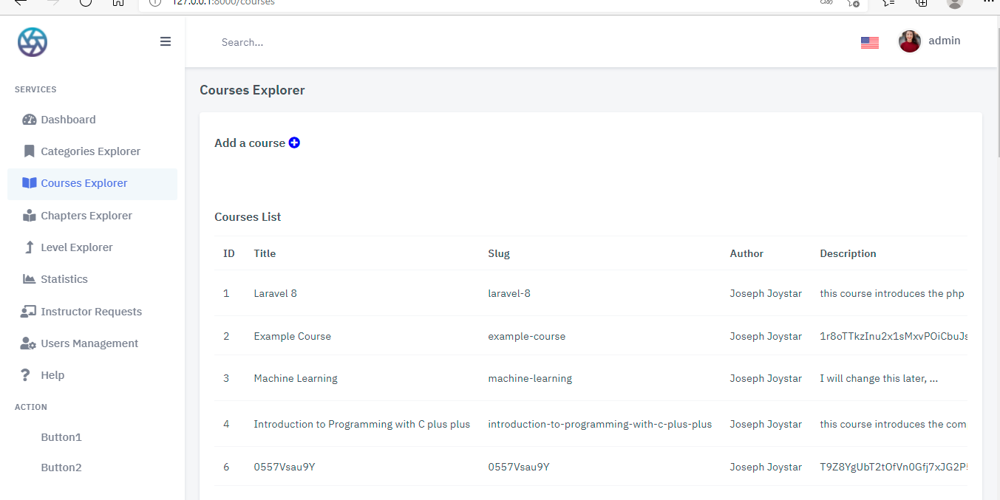
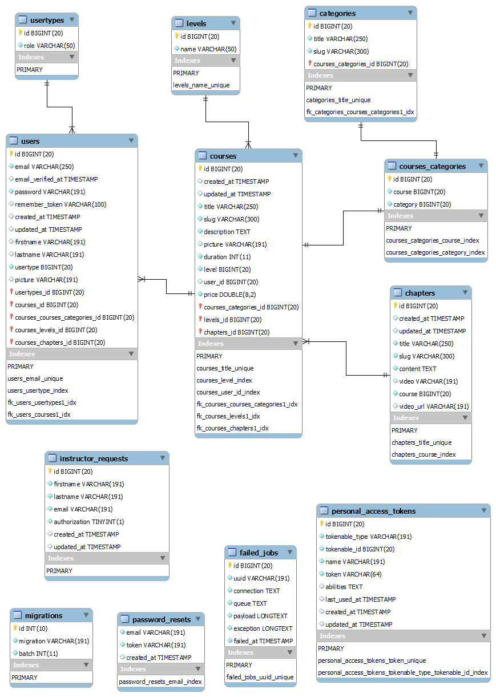

# Introduction #
This document provides the instructions for using the Sigma E-Learning Application developed by ***Dieuveille BOUSSA ELLENGA***.   
The Sigma E-Learning App is a well documented PHP / Laravel-based Software (web application) for e-learning, the platform allows multiple type users management (2: Admin & Instructor),  
gives access to visitors to learn from the available courses, and if they feel like sharing their knowledge, a visitor can fill a form to become an instructor on the platform and create courses.  
The Sigma E-Learning Application is based on the CRUD user interface convention, with restrictions depending on users and/or non users.  

# Document #

## Target audience ##

This document is targeted (but not limited) to technical individual with a Web Development (PHP) background 

## Definition ##

The Sigma E-Learning is based on the CRUD user interface convention.  

Create: Specific users (Admin or instructor) can add new course instances 

Read: Everyone can access the content of the platform, … 

Update: A course can be updated or modified under some conditions / restrictions, ...  

Delete: A course can be deleted under some conditions / restrictions, ...

# Application components #

The Sigma E-Learning is comprised of a user management module (mostly for the admin) and a course module (with subcomponent like categories, chapters for each course, levels, ...) for everyone.  

Yet, it is a small and simple implementation of an e-learning platform and can be considered as a module itself, a module to further improve and / or to integrate into another. 

The database is comprised of 12 tables, and they share relationships ... refer to **ER Diagram**

The registration functionality has been disabled.   
To create an account and become an instructor on the platform:   
- A visitor must fill a form, then the admin will decide whether to let the visitor become an instructor.  

- If so, there is an admin panel where the admin has just to click a button and the new user instance is generated automatically.  
A mail is then sent to the user to create his password and access the platform.

There are two ways to use this module:  
- Starting a fresh new project and following this as an example ( and go further )     

- Using the project as base and add other modules in it.  

  

## 3.1 Starting New Project ##   

Sigma E Learning Module must be integrated in another project / website. 

**Not Necessary**

**...**
**...**
**...**

## 3.2 Cloning this project ## 

We clone the specific repository or download the compressed project.    

The project contains the public folder with resources (css, fonts, js, images, ...)

We open our project directory **sigma-elearning** which you can rename

Beforehand,  ... for the name refer to  .env.example  or just pick any name then put that name in the  .env

After successfully creating our database, we go back to our folder directory and open our cmd / command prompt / bash / terminal, ...

- We first install composer by running  **composer install**  

- We copy the  .env.example and rename it to  **.env**  in the same directory

    Fill in the necessary information i.e. database name, host, username, password  
    
    And we will need mailtrap, or any mail provider ...
        MAIL_MAILER=smtp
        MAIL_HOST=smtp.mailtrap.io
        MAIL_PORT=2525
        MAIL_USERNAME=**************
        MAIL_PASSWORD=**************
        MAIL_ENCRYPTION=tls
        MAIL_FROM_ADDRESS="noreply@test.com"
        MAIL_FROM_NAME="${APP_NAME}"

- We then run  **php artisan key:generate** 

- Also, we make a storage link by running  **php artisan storag:link**  

- Finally, we run  *php artisan migrate* and  *php artisan db:seed*  or we just run  **php artisan migrate:fresh --seed**

- And, so far so good. We can launch our project now with  php artisan serve.

